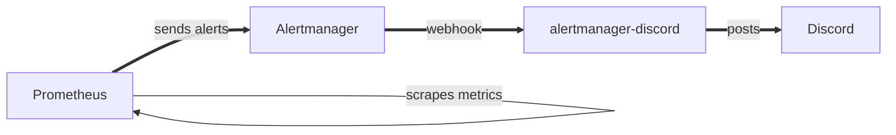
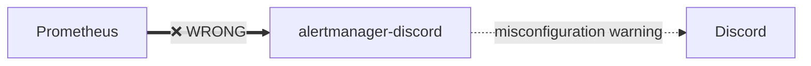

# alertmanager-discord


[](https://codecov.io/gh/SimplicityGuy/alertmanager-discord)
[](https://go.dev/)

[](https://github.com/pre-commit/pre-commit)

A lightweight Go webhook service that receives alerts from Prometheus Alertmanager and forwards them to Discord channels via webhooks.

## Features

- 🚀 **Lightweight** - Minimal resource usage with scratch-based Docker image
- 🔔 **Real-time Alerts** - Instant Discord notifications for firing and resolved alerts
- 🎨 **Color-coded Messages** - Red for firing alerts, green for resolved
- 🔍 **Misconfiguration Detection** - Warns if receiving raw Prometheus alerts instead of Alertmanager
- 🏥 **Health Checks** - Built-in health endpoint for container orchestration
- 🐳 **Multi-platform** - Supports linux/amd64, linux/arm64, linux/arm/v7, linux/arm/v6
- 🔒 **Secure** - Runs as non-root user in minimal container

## Example Notification


## Warning

⚠️ **This program is NOT a replacement for Alertmanager**

This service accepts webhooks **from Alertmanager**, not directly from Prometheus.

### Correct Data Flow



### Incorrect Configuration



If you connect Prometheus directly to this service, you'll receive a misconfiguration warning message in Discord.

## Installation

### Docker (Recommended)

Pull the latest image from GitHub Container Registry:

```bash
docker pull ghcr.io/simplicityguy/alertmanager-discord:latest
```

Run the container:

```bash
docker run -d \
  --name alertmanager-discord \
  -p 9094:9094 \
  -e DISCORD_WEBHOOK="https://discord.com/api/webhooks/..." \
  ghcr.io/simplicityguy/alertmanager-discord:latest
```

### Docker Compose

```yaml
version: '3.8'
services:
  alertmanager-discord:
    image: ghcr.io/simplicityguy/alertmanager-discord:latest
    ports:
      - "9094:9094"
    environment:
      - DISCORD_WEBHOOK=https://discord.com/api/webhooks/...
      - LISTEN_ADDRESS=0.0.0.0:9094
    restart: unless-stopped
    healthcheck:
      test: ["/go/bin/alertmanager-discord", "-healthcheck"]
      interval: 30s
      timeout: 3s
      retries: 3
      start_period: 5s
```

### Binary Release

Download the latest release for your platform from the [releases page](https://github.com/SimplicityGuy/alertmanager-discord/releases).

```bash
# Linux
./alertmanager-discord -webhook.url="https://discord.com/api/webhooks/..."

# macOS
./alertmanager-discord.darwin -webhook.url="https://discord.com/api/webhooks/..."
```

### Build from Source

```bash
git clone https://github.com/SimplicityGuy/alertmanager-discord.git
cd alertmanager-discord
go build -o alertmanager-discord
./alertmanager-discord -webhook.url="https://discord.com/api/webhooks/..."
```

## Configuration

### Environment Variables

| Variable          | Required | Default          | Description                |
| ----------------- | -------- | ---------------- | -------------------------- |
| `DISCORD_WEBHOOK` | Yes      | -                | Discord webhook URL        |
| `LISTEN_ADDRESS`  | No       | `127.0.0.1:9094` | Host and port to listen on |

### Command-line Flags

| Flag              | Description                             | Default          |
| ----------------- | --------------------------------------- | ---------------- |
| `-webhook.url`    | Discord webhook URL (overrides env var) | -                |
| `-listen.address` | Listen address (overrides env var)      | `127.0.0.1:9094` |
| `-healthcheck`    | Perform health check and exit           | -                |

**Note:** Environment variables take precedence over CLI flags.

### Discord Webhook Setup

1. Open your Discord server
1. Go to **Server Settings** → **Integrations** → **Webhooks**
1. Click **New Webhook**
1. Name it (e.g., "Alertmanager")
1. Select the channel for alerts
1. Copy the webhook URL
1. Use this URL in your configuration

### Prometheus Configuration

Configure Prometheus to send alerts to Alertmanager:

```yaml
# prometheus.yml
alerting:
  alertmanagers:
    - static_configs:
        - targets:
            - 'alertmanager:9093'
```

### Alertmanager Configuration

Configure Alertmanager to send webhooks to alertmanager-discord:

```yaml
# alertmanager.yml
global:
  smtp_smarthost: 'localhost:25'
  smtp_from: 'alertmanager@example.org'

# The directory from which notification templates are read
templates:
  - '/etc/alertmanager/template/*.tmpl'

# The root route on which each incoming alert enters
route:
  group_by: ['alertname']
  group_wait: 20s
  group_interval: 5m
  repeat_interval: 3h
  receiver: discord_webhook

receivers:
  - name: 'discord_webhook'
    webhook_configs:
      - url: 'http://alertmanager-discord:9094'
        send_resolved: true
```

### Testing the Setup

Send a test webhook to verify the configuration:

```bash
curl -X POST http://localhost:9094 \
  -H "Content-Type: application/json" \
  -d '{
    "alerts": [{
      "status": "firing",
      "labels": {
        "alertname": "TestAlert",
        "instance": "localhost"
      },
      "annotations": {
        "description": "This is a test alert"
      }
    }]
  }'
```

## Development

### Prerequisites

- Go 1.20 or higher
- Docker (for containerized development)
- pre-commit (optional, for git hooks)

### Local Development

1. Clone the repository:

```bash
git clone https://github.com/SimplicityGuy/alertmanager-discord.git
cd alertmanager-discord
```

2. Install dependencies:

```bash
go mod download
```

3. Set up pre-commit hooks (optional):

```bash
pip install pre-commit
pre-commit install
```

4. Run the service:

```bash
export DISCORD_WEBHOOK="https://discord.com/api/webhooks/..."
go run main.go detect-misconfig.go
```

### Running Tests

```bash
# Run all tests
go test -v ./...

# Run tests with coverage
go test -v -race -coverprofile=coverage.out -covermode=atomic ./...

# View coverage report
go tool cover -html=coverage.out

# Run benchmarks
go test -bench=. -benchmem ./...
```

### Code Quality Checks

```bash
# Run all pre-commit hooks
pre-commit run --all-files

# Go formatting
gofmt -l -w .

# Go vet
go vet ./...

# golangci-lint
golangci-lint run --timeout=5m

# Dockerfile linting
hadolint Dockerfile
```

### Building Docker Image

```bash
# Build for local platform
docker build -t alertmanager-discord .

# Build for multiple platforms
docker buildx build \
  --platform linux/amd64,linux/arm64,linux/arm/v7,linux/arm/v6 \
  -t alertmanager-discord \
  .
```

## CI/CD

This project uses GitHub Actions for continuous integration and deployment.

### Workflows

| Workflow                | Trigger                 | Purpose                                           |
| ----------------------- | ----------------------- | ------------------------------------------------- |
| **Code Quality**        | Push, PR                | Runs pre-commit, golangci-lint, and go fmt checks |
| **Tests**               | Push, PR                | Runs unit tests with coverage reporting           |
| **Docker Validate**     | Push, PR (Docker files) | Validates Dockerfiles and tests builds            |
| **Build**               | Push to main, Schedule  | Builds and publishes multi-platform Docker images |
| **Update Dependencies** | Weekly, Manual          | Automated dependency updates via PR               |
| **Cleanup Cache**       | PR closed               | Removes caches for closed PRs                     |
| **Cleanup Images**      | Monthly, Manual         | Removes old Docker images from GHCR               |

### Automated Features

- ✅ **Dependency Updates** - Weekly automated PRs for Go module updates
- ✅ **Code Coverage** - Automatic coverage reports on PRs via Codecov
- ✅ **Multi-platform Builds** - Automatic builds for 4 architectures
- ✅ **Cache Management** - Automatic cleanup of stale caches and images
- ✅ **Quality Gates** - All PRs must pass linting, tests, and formatting
- ✅ **Discord Notifications** - Build status notifications to Discord

## Architecture

### Project Structure

```
alertmanager-discord/
├── main.go              # Main service with webhook receiver
├── detect-misconfig.go  # Misconfiguration detection logic
├── go.mod              # Go module definition
├── go.sum              # Go module checksums
├── Dockerfile          # Multi-stage Docker build
├── .dockerignore       # Docker build exclusions
├── .gitignore          # Git exclusions
├── .pre-commit-config.yaml  # Pre-commit hook configuration
├── .yamllint           # YAML linting rules
├── .github/
│   └── workflows/      # GitHub Actions workflows
├── images/             # Documentation images
└── README.md           # This file
```

### How It Works

1. **Webhook Receiver** - HTTP server listening on configured address (default: `127.0.0.1:9094`)
1. **Alert Parser** - Unmarshals Alertmanager JSON into Go structures
1. **Misconfiguration Detector** - Validates incoming payloads are from Alertmanager
1. **Discord Formatter** - Transforms alerts into Discord embeds with color coding:
   - 🔴 Red (0x992D22) - Firing alerts
   - 🟢 Green (0x2ECC71) - Resolved alerts
   - ⚪ Grey (0x95A5A6) - Unknown status
1. **Alert Grouper** - Groups alerts by status before sending to Discord

### Health Checks

The service includes a built-in health check endpoint:

```bash
# HTTP endpoint
curl http://localhost:9094/health
# Returns: {"status":"ok"}

# Docker health check
docker exec alertmanager-discord /go/bin/alertmanager-discord -healthcheck
# Exit code 0 = healthy, 1 = unhealthy
```

## Contributing

Contributions are welcome! Please follow these guidelines:

1. **Fork the repository** and create a feature branch
1. **Install pre-commit hooks**: `pre-commit install`
1. **Write tests** for new functionality
1. **Ensure all tests pass**: `go test ./...`
1. **Run code quality checks**: `pre-commit run --all-files`
1. **Commit with conventional commits**: `feat:`, `fix:`, `docs:`, etc.
1. **Submit a pull request** with a clear description

### Code Standards

- Follow [Go Code Review Comments](https://github.com/golang/go/wiki/CodeReviewComments)
- Use `gofmt` for formatting
- Run `golangci-lint` and address all issues
- Maintain test coverage above 80%
- Add documentation for public APIs
- Use conventional commit messages

## License

This project is licensed under the Apache-2.0 License - see the [LICENSE](LICENSE) file for details.

## Acknowledgments

- Original inspiration from [benjojo/alertmanager-discord](https://github.com/benjojo/alertmanager-discord)
- Built with Go and love for the monitoring community
- Thanks to all contributors and users

## Support

- **Issues**: [GitHub Issues](https://github.com/SimplicityGuy/alertmanager-discord/issues)
- **Discussions**: [GitHub Discussions](https://github.com/SimplicityGuy/alertmanager-discord/discussions)
- **Security**: Please report security issues privately via GitHub Security Advisories

## Links

- **Docker Images**: [GHCR Package](https://github.com/users/SimplicityGuy/packages/container/package/alertmanager-discord)
- **Source Code**: [GitHub Repository](https://github.com/SimplicityGuy/alertmanager-discord)
- **CI/CD**: [GitHub Actions](https://github.com/SimplicityGuy/alertmanager-discord/actions)
- **Prometheus**: [prometheus.io](https://prometheus.io/)
- **Alertmanager**: [Alertmanager Documentation](https://prometheus.io/docs/alerting/latest/alertmanager/)
- **Discord Webhooks**: [Discord Webhook Guide](https://support.discord.com/hc/en-us/articles/228383668-Intro-to-Webhooks)
